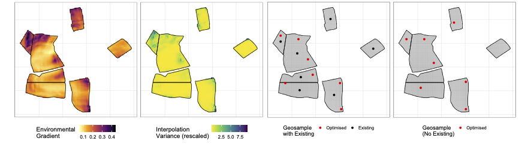

# GeoSensor network optimisation without measurement to support decisions at multiple scales

Alexis Comber<sup>1*</sup>, Peter Atkinson<sup>2</sup>, Chris Brunsdon<sup>3</sup> Martin Callghan<sup>4</sup> and Paul Harris<sup>5</sup>

<sup>1</sup> School of Geography, University of Leeds, Leeds, UK\
<sup>2</sup> Faculty of Science and Technology, Lancaster University, UK\
<sup>3</sup> National Centre for Geocomputation, Maynooth University, Ireland\
<sup>4</sup> Research Software Engineering, University of Leeds, UK\
<sup>5</sup> Sustainable Agriculture Sciences North Wyke, Rothamsted Research, Okehampton, UK.

<sup>*</sup> contact author: a.comber@leeds.ac.uk

Code and Data supporting the proposal to the BBSRC Molecules to Landscape call (March 2022). It undertales an optimisation of geosample locations using an example case study.



## Summary
This project proposes a process agnostic, parsimonious approach to sample design. Sample configurations are evaluated using estimated prediction variance (EPV), a Gaussian Process (GP) model [1]. EPV provides a measure of the benefit of sampling at any potential location. Previous research has shown that processes can be approximated by underlying environmental gradients [2]. EPV is conditional on only the sample design and freely available environmental data, not measurements of the process. Crucially, this method circumvents the need for large sample sizes of the process to define the GP, which has hindered the take-up of model-based sample designs in agriculture.

Spatial sampling is optimised to minimise the mean EPV weighted by distances to ensure even coverage. Sample location optimality conceptualised in this way underpins the optimisation evaluation function. Thus, sets of sample locations are identified that are sensitive to local environmental gradient variability, over different spatial extents (decision-making scales).

The evaluation calculates the EPV from the environmental gradients at any current and proposed sample locations. This variance is used by a search heuristic (eg, GAs, GGAs, p-median, Pareto MCO, etc) to identify sets of n that are optimal at different scales. Operationally, this is similar to [3].

The method will be evaluated using point process methods [4] to compare the optimal sample configurations generated from underlying environmental gradients (ie, independent of measurement) with those generated from NWFP measured data. The NWFP has three instrumented farms, in situ sensors and extensive soil survey datasets. Evaluations will incorporate different sample sizes, measured data and simulated data conditioned by measured data.

### References
[1] Yamamoto https://doi.org/10.1023/A:1007577916868 \
[2] Comber https://doi.org/10.3389/fsufs.2019.00042 \
[3] Brus https://doi.org/10.1016/j.geoderma.2018.07.036 \
[4] Fuentes-Santos https://doi.org/10.1080/03610918.2021.1901118 \

## To run the code
To run the analysis in this paper you should download the the R script `m2l_cfs_code.R` and install the packages. Package and other info is below. The data files and supporting scripts will need will need to be locally available. The code recreates the figure as the same sequence as in the proposal, although note the search may generate slightly different results ude to is random seeding.

If you have any problems with data / code / versions etc please contact Lex Comber at the email above.

```{r}
sessionInfo()
R version 4.0.4 (2021-02-15)
Platform: x86_64-apple-darwin17.0 (64-bit)
Running under: macOS Big Sur 10.16

Matrix products: default
LAPACK: /Library/Frameworks/R.framework/Versions/4.0/Resources/lib/libRlapack.dylib

locale:
[1] en_GB.UTF-8/en_GB.UTF-8/en_GB.UTF-8/C/en_GB.UTF-8/en_GB.UTF-8

attached base packages:
[1] stats     graphics  grDevices utils     datasets  methods   base     

other attached packages:
 [1] raster_3.5-2    intamap_1.4-9   sp_1.4-6        terra_1.4-11   
 [5] gstat_2.0-7     forcats_0.5.1   stringr_1.4.0   dplyr_1.0.5    
 [9] purrr_0.3.4     readr_1.4.0     tidyr_1.1.3     tibble_3.1.1   
[13] ggplot2_3.3.5   tidyverse_1.3.1 sf_1.0-6       

loaded via a namespace (and not attached):
 [1] httr_1.4.2         jsonlite_1.7.2     viridisLite_0.4.0  foreach_1.5.1     
 [5] modelr_0.1.8       assertthat_0.2.1   cellranger_1.1.0   pillar_1.6.0      
 [9] backports_1.2.1    lattice_0.20-41    glue_1.4.2         automap_1.0-14    
[13] digest_0.6.27      rvest_1.0.0        colorspace_2.0-0   plyr_1.8.6        
[17] pkgconfig_2.0.3    broom_0.7.6        haven_2.4.0        mvtnorm_1.1-1     
[21] scales_1.1.1       intervals_0.15.2   proxy_0.4-26       generics_0.1.0    
[25] farver_2.1.0       ellipsis_0.3.1     withr_2.4.2        cli_2.4.0         
[29] magrittr_2.0.1     crayon_1.4.1       readxl_1.3.1       ps_1.6.0          
[33] fs_1.5.0           fansi_0.4.2        doParallel_1.0.16  MASS_7.3-53.1     
[37] xts_0.12.1         xml2_1.3.2         class_7.3-18       FNN_1.1.3         
[41] tools_4.0.4        hms_1.0.0          lifecycle_1.0.0    munsell_0.5.0     
[45] reprex_2.0.0       compiler_4.0.4     e1071_1.7-9        spacetime_1.2-5   
[49] evd_2.3-4          rlang_0.4.10       classInt_0.4-3     units_0.7-1       
[53] grid_4.0.4         iterators_1.0.13   rstudioapi_0.13    labeling_0.4.2    
[57] gtable_0.3.0       codetools_0.2-18   DBI_1.1.1          reshape_0.8.8     
[61] R6_2.5.0           zoo_1.8-9          lubridate_1.7.10   rgdal_1.5-23      
[65] utf8_1.2.1         KernSmooth_2.23-18 stringi_1.5.3      parallel_4.0.4    
[69] Rcpp_1.0.7         vctrs_0.3.7        dbplyr_2.1.1       tidyselect_1.1.0 
```
